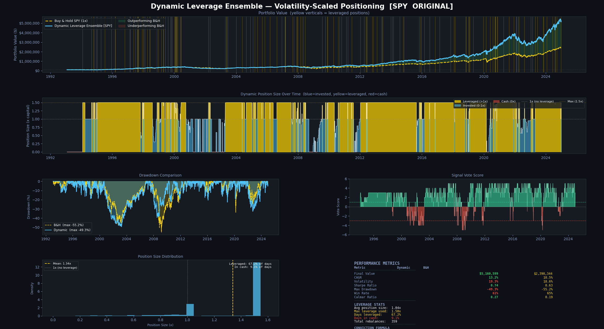
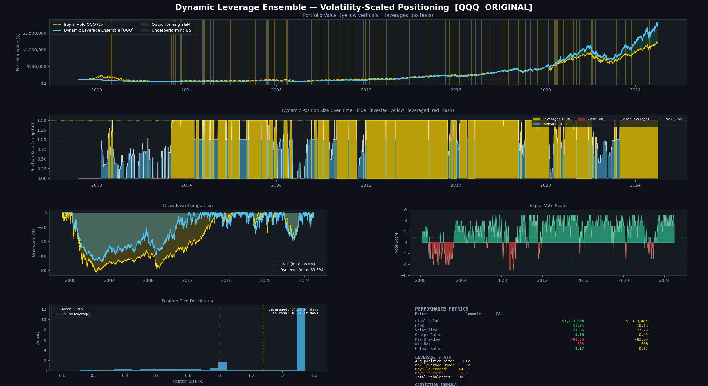
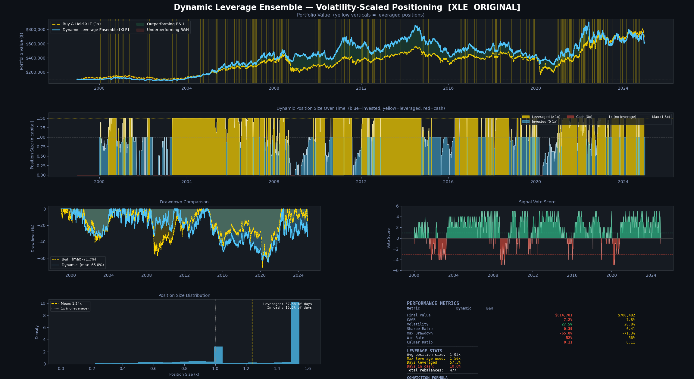

# SPY Ensemble Backtest

A rules-based trading strategy that decides how much to invest in SPY (and QQQ / XLE) by having several market signals "vote," then sizes the position based on how much they agree and how risky the market looks. Built as part of my high school senior research project, *Algorithms Over Instinct*, which asked whether quant models can beat human judgment.

Backtested from 1993 to 2024 against simple buy-and-hold.

## How it works

Every few trading days the strategy checks up to 8 signals. Each one votes bullish (+1), neutral (0), or bearish (-1):

| # | Signal | What it looks at |
|---|--------|------------------|
| 1 | VIX Monte Carlo | Simulates where the VIX (fear index) is likely to go over the next week using a mean-reverting (Ornstein-Uhlenbeck) model |
| 2 | VIX term structure | Short-term vs 3-month VIX. Short above long usually means near-term panic |
| 3 | Economic activity | Industrial production vs its recent trend (FRED: INDPRO) |
| 4 | Market sentiment | Small caps (IWM) vs large caps (SPY). Small caps leading = healthy risk appetite |
| 5 | Moving average trend | Price above or below its moving average |
| 6 | Momentum | Past ~12 month return, skipping the most recent weeks |
| 7 | Credit spreads | High-yield bond spreads (FRED). Wide spreads = stress |
| 8 | Yield curve | 10Y minus 2Y Treasury. Inverted = recession warning |

The votes are added up into a score. Then the position size is:

```
size = base (from score) x volatility scalar x VIX scalar x momentum scalar
```

- Strong agreement = bigger position, with up to 1.3x to 1.5x leverage allowed
- High recent volatility or a high VIX = smaller position
- Very bearish score = move to cash and rotate into long-term Treasuries (TLT)

Leverage includes a borrowing cost, and every trade includes a transaction cost.

## Results (original version)

| Ticker | Period | Strategy CAGR | B&H CAGR | Sharpe (strat / B&H) | Max drawdown (strat / B&H) | Beat B&H? |
|--------|--------|---------------|----------|----------------------|----------------------------|-----------|
| SPY | 1993-2024 | 13.2% | 10.5% | 0.74 / 0.63 | -49.3% / -55.2% | Yes |
| QQQ | 1999-2024 | 11.7% | 10.1% | 0.59 / 0.49 | -68.5% / -83.0% | Yes |
| XLE | 1998-2024 | 7.2% | 7.8% | 0.39 / 0.41 | -65.0% / -71.3% | No |

SPY by period:

| Period | Strategy CAGR | B&H CAGR | Strategy max DD | B&H max DD |
|--------|---------------|----------|-----------------|------------|
| 1994-1999 (tech bubble) | 26.0% | 23.3% | -18.9% | -19.0% |
| 2000-2009 (two crashes) | 1.5% | -0.9% | -49.3% | -55.2% |
| 2010-2019 (bull market) | 15.6% | 13.3% | -22.7% | -19.3% |
| 2020-2024 (COVID + 2022) | 20.7% | 14.4% | -32.7% | -33.7% |

All results include transaction and borrowing costs.

**Caveats:**
- A big part of the edge is leverage. The strategy sat at 1.5x on 57% to 67% of days, so it's partly just taking more risk when markets are calm.
- It didn't work on XLE. Energy is driven by oil prices, and the signals were built around broad stock market behavior.
- The original thresholds were still picked by someone who knew how 1993 to 2024 played out, so this isn't a true out-of-sample test either.

### Charts





## Files

| File | What it is |
|------|------------|
| `original_strategy.py` | The first version. Hand-picked thresholds, 5 active signals (no FRED data needed) |
| `optimized_strategy.py` | All 8 signals, with thresholds tuned by a Bayesian optimizer to maximize Sharpe ratio |
| `trade_explainer.py` | Re-runs the optimized strategy and prints every trade with each signal's vote and the reasoning behind the position size |

Each script runs on SPY, QQQ, and XLE and saves a chart with portfolio value, leverage over time, drawdowns, vote scores, and a metrics table (CAGR, volatility, Sharpe, max drawdown, Calmar).

## What I learned (the honest part)

The optimized version looks better on paper, but its thresholds were tuned on the **same 1993 to 2024 data it's tested on**. That's in-sample optimization, so its results are almost certainly overfit. The optimizer found settings that fit the past, not settings that predict the future.

That realization shaped my next project, where I held out 2023 to 2026 as unseen test data and compared every strategy against 1,000 random-entry simulations. On unseen data, none of the strategies beat buy-and-hold.

The biggest takeaway: a great backtest is easy to make. A strategy that holds up on data it has never seen is the hard part.

## Run it yourself

```bash
pip install -r requirements.txt

# original version (no API key needed)
python original_strategy.py

# optimized version + explainer need a free FRED API key
# get one at https://fred.stlouisfed.org/docs/api/api_key.html
export FRED_API_KEY=your_key_here
python optimized_strategy.py
python trade_explainer.py
```

Price data comes from Yahoo Finance (via `yfinance`) and macro data from FRED.

## Tools

Python, pandas, NumPy, matplotlib, yfinance, FRED API
